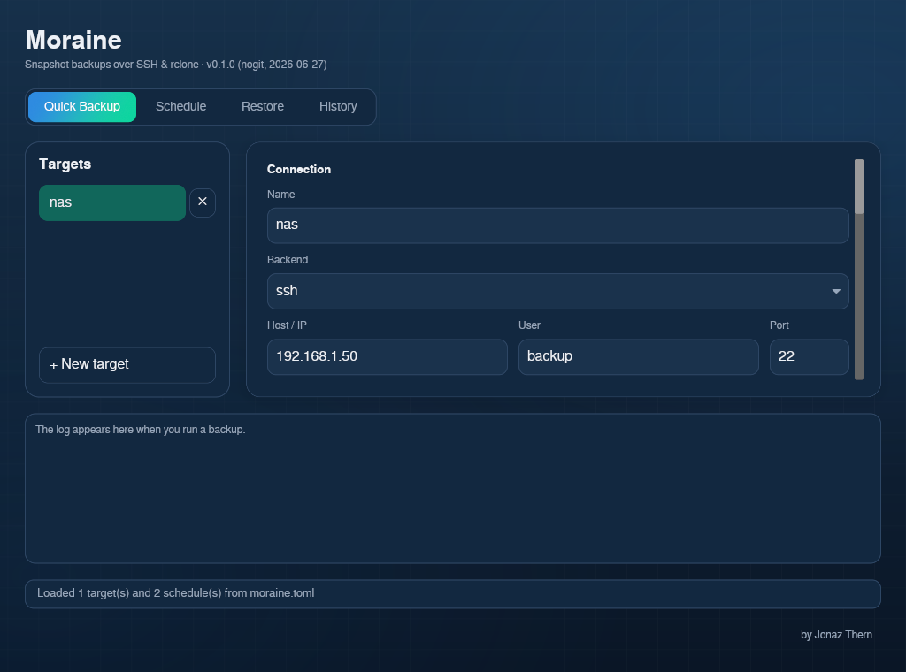

<div align="center">
  
  <h1>Moraine</h1>
  <p><strong>Snapshot-based backup over SSH/rsync and rclone — CLI + desktop client.</strong></p>
</div>

<p align="center"></p>

Moraine takes **hardlinked snapshots** of your files to any destination: a NAS/server
over SSH, or cloud/FTP/SMB/WebDAV/S3/Drive via rclone. Every run becomes its own
timestamped snapshot where unchanged files share storage — full history at almost no
extra disk cost. Restore whole snapshots or individual files, schedule via cron, and
prune old snapshots automatically with a retention policy.

## Features

- **Snapshots** — `<dest>/<name>/<timestamp>/` using rsync `--link-dest` (hardlinks) plus a `latest` pointer.
- **Backends** — `ssh` (rsync over SSH) and `rclone` (cloud, **FTP**, SFTP, SMB, WebDAV, S3, Drive, B2 …). FTP is built in: enter host/user/password right in the app.
- **Restore** — list snapshots, browse the file tree, restore everything or selected files/folders.
- **Retention / pruning** (GFS) — keep N latest + N daily/weekly/monthly; auto-prune after each run.
- **Scheduling** — multiple schedules per target, installed into crontab (or Windows Task Scheduler).
- **Live progress** — a progress bar with transferred amount, rate and ETA while a run streams.
- **Run history** — every backup/restore/prune is recorded and shown in a History tab.
- **Per-target VPN** — optionally bring a NetworkManager VPN up before a backup and down after.
- **Desktop client** (GTK 4) with a themed UI, native file pickers, a per-target settings modal, start-at-login and encrypted config export/import.

## Installation

### Debian / Ubuntu / Linux Mint
```bash
sudo apt install ./moraine_0.1.26-1_amd64.deb
```
Installs `moraine` (CLI) and `moraine-gui` (desktop) plus a menu entry. Dependencies:
`rsync`, `openssh-client`; recommended: `rclone`, `xdg-desktop-portal`.

### Arch Linux
Install the prebuilt package straight from the release:
```bash
sudo pacman -U https://github.com/TheJonaz/moraine-backup/releases/download/v0.1.26/moraine-0.1.26-1-x86_64.pkg.tar.zst
```
Or build it yourself with the `PKGBUILD` (needed if your pacman requires signed
packages):
```bash
mkdir moraine && cd moraine
curl -O https://raw.githubusercontent.com/TheJonaz/moraine-backup/v0.1.26/packaging/aur/PKGBUILD
makepkg -si
```
Runtime deps: `gtk4`, `rsync`, `openssh`; optional: `rclone`, `gnupg`,
`networkmanager`. (An AUR package `moraine` is planned once AUR registration
reopens.)

### macOS (CLI)
The command-line client via Homebrew (the desktop app is Linux-only):
```bash
brew install TheJonaz/moraine/moraine
```
Brings in a modern `rsync` (macOS ships an old 2.6.9). For the rclone backend:
`brew install rclone`.

### Windows (CLI)
The command-line client via [Scoop](https://scoop.sh):
```powershell
scoop bucket add moraine https://github.com/TheJonaz/scoop-moraine
scoop install moraine
```
The rclone backend needs only `scoop install rclone`; the rsync/SSH backend
needs `rsync`/`ssh` on `PATH` (WSL, MSYS2 or Git-for-Windows).

### Build from source
```bash
cargo build --release
./target/release/moraine --help
./target/release/moraine-gui
```
Build a `.deb`: `cargo install cargo-deb && cargo deb`.

## Platform support

Both binaries are pure Rust and build on Linux, macOS and Windows; CI builds and
tests all three on every push, and tagged releases ship a binary archive per OS
(plus a `.deb` for Linux). What each platform needs at runtime:

| Platform    | Build | rsync/SSH backend         | rclone backend | Scheduling           |
|-------------|:-----:|---------------------------|----------------|----------------------|
| Linux       |  ✅   | `rsync` + `openssh-client`| `rclone`       | `crontab` ✅         |
| macOS       |  ✅   | `rsync` + `ssh` (bundled) | `rclone` (brew)| `crontab` ✅         |
| Windows     |  ✅   | needs `rsync`/`ssh`¹      | `rclone`       | Task Scheduler ✅    |

¹ Windows has no bundled rsync; install via WSL, MSYS2 or Git-for-Windows, or
use the rclone backend (SFTP/FTP/SMB/cloud), which needs only the `rclone`
binary on `PATH`.

The **Schedule** tab installs jobs into the platform scheduler automatically:
`crontab` on Linux/macOS, **Windows Task Scheduler** on Windows (each schedule
becomes a task under the `\Moraine\` folder, driven by a small `.cmd` wrapper in
`%APPDATA%\Moraine\tasks\`).

## CLI

```bash
moraine init                       # create an example config (moraine.toml)
moraine verify                     # test SSH/key/sources/dest
moraine run [--target NAME] [--dry-run]
moraine list --target NAME         # list snapshots
moraine check [--target NAME] [--snapshot TS]  # checksum-verify a snapshot
moraine prune [--target NAME] [--dry-run]
```

**Ad-hoc backups — no config file.** `moraine run` can define a whole target
from flags, handy for one-off jobs and scripts:

```bash
moraine run --host nas --user me --key ~/.ssh/id --dest /backups --source ~/docs
```

Works for every backend (`--backend ssh|rclone|ftp`), takes repeated
`--source`/`--exclude`, plus `--port`, `--name`, `--bwlimit`,
`--strict-host-key` and destination encryption
(`--crypt-password`/`--crypt-salt`). Secrets are better passed via the
`MORAINE_PASSWORD` / `MORAINE_CRYPT_PASSWORD` environment variables than as
flags — flag values are visible to other local users in `ps`. Ad-hoc runs
transfer and snapshot exactly like configured targets, but skip history,
healthcheck pings and notifications.

## Config (`moraine.toml`)

```toml
[[target]]
name    = "nas"
host    = "192.168.1.50"          # IP or hostname
user    = "backup"
key     = "~/.ssh/id_ed25519"     # optional, otherwise ssh-agent
dest    = "/volume1/backups"
sources = ["/home/jonaz/documents", "/home/jonaz/pictures"]
exclude = ["*.tmp", "node_modules"]
# vpn   = "home-vpn"              # optional NetworkManager connection to raise for this backup

[target.retention]
keep_last = 7
keep_monthly = 6

# rclone backend (cloud/FTP/SMB/WebDAV/S3 …):
# [[target]]
# name = "ftp"
# backend = "ftp"                 # or "rclone" + host = <rclone-remote>
# host = "ftp.example.com"
# user = "jonaz"
# password = "..."
# dest = "backups"
# sources = ["/home/jonaz/documents"]
```

See [`moraine.example.toml`](moraine.example.toml) for a complete template.

## Architecture

A `moraine` library (engine: config, rsync, snapshot, ssh, rclone, prune, history)
plus two binaries (`moraine` CLI, `moraine-gui` desktop). The backends currently shell
out to external tools (`rsync`/`ssh`/`rclone`); a transport abstraction for in-process
Rust is planned for broader portability (Windows without rsync, mobile).

## Security

Moraine handles credentials for your backup destinations. How they are protected:

- **Secrets on disk are owner-only.** The config (`moraine.toml`) can hold SSH
  passwords / key passphrases and FTP passwords in plaintext, and the run log
  (`history.jsonl`) can contain paths and backend error text — both are written
  with mode `0600` (a pre-existing looser file is tightened on the next write).
  To move a config between machines, use **⚙ Settings → Export config**, which
  encrypts it with a password (gpg, AES-256).
- **Passwords are never passed as command-line arguments** (which are visible to
  other users via `ps`). SSH/rsync authenticate through OpenSSH's `SSH_ASKPASS`
  helper — a tiny script in a **private per-user directory** (`$XDG_RUNTIME_DIR`)
  that reads the secret from the environment; `gpg` reads its passphrase on
  stdin; and `rclone obscure` reads the password on stdin.
- **Host keys.** By default SSH uses `StrictHostKeyChecking=accept-new`: an
  unknown host key is trusted on first connect and pinned in `known_hosts`; a
  later change is rejected. Set `strict_host_key = true` on a target (or tick
  *Require known SSH host key* in its Settings) to require the key to already
  be in `known_hosts`, protecting the first connection too. **Recommended for
  targets that log in with a password**: with trust-on-first-use, an attacker
  who intercepts the *very first* connection could pose as the server and
  capture the password (a key-based login never reveals a reusable secret, so
  the default is a smaller risk there). Run *Test connection* once — or
  `ssh user@host` manually — to pin the key before enabling strict mode.
- **Scheduling is injection-safe.** Schedule names/targets are rejected if they
  contain control characters and are shell-quoted before being written to
  crontab (or the Windows `.cmd` wrapper), so a crafted or imported config can't
  inject commands.
- **FTP credentials stay out of the process list.** The FTP backend passes
  host/user/password to rclone via `RCLONE_FTP_*` environment variables (the
  environment is private to the process owner), not in the connection string
  on the command line.
- **Configs are validated (including on import).** A target name can't traverse
  outside the destination (`/`, `..`, `latest` are rejected), and a
  key/host/user can't smuggle extra flags into rsync/ssh (leading `-` or
  whitespace is rejected); positional paths are passed after `--`. So importing
  an encrypted config from an untrusted source can't run commands or touch data
  outside its own destination.

## License

[MIT](LICENSE) © 2026 Jonaz Thern
